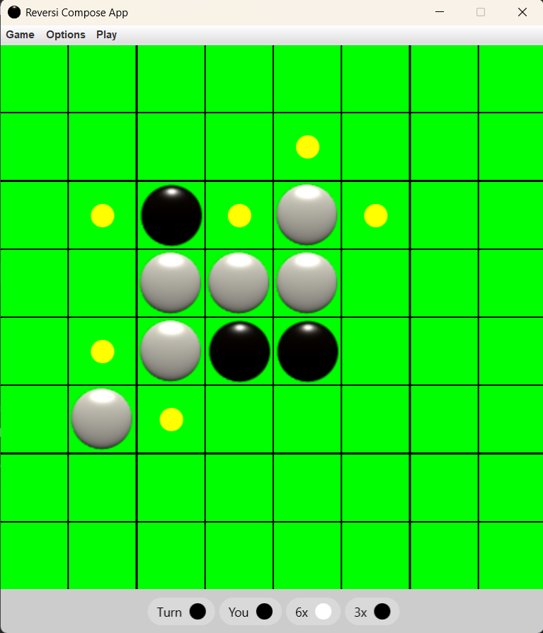

# Reversi Game

A simple implementation of the classic board model *Reversi* (also known as *Othello*) in Kotlin. This project simulates the gameplay for two players, where each player alternates turns placing pieces on an 8x8 grid, aiming to "flip" the opponent's pieces and control more of the board by the end of the model.

## Features

- **8x8 Game Board**: The model uses a standard 8x8 board with two colors of pieces (black and white).
- **Turn-Based Gameplay**: Players take turns placing their pieces on the board.
- **Move Validation**: Moves are validated for correctness, ensuring pieces can only be placed in valid positions where they can flip the opponent's pieces.
- **Victory Condition**: The model ends when there are no more valid moves for either player. The player with the most pieces on the board at the end wins.
- **Game Flow Management**: Includes features to start a new model, check for victory, save/load model progress.

## Installation

1. Clone the repository:
   ```bash
   git clone https://github.com/your-username/reversi-model.git

2. Navigate to the project directory:
   ```bash
   cd reversi-model

3. Open the project in your preferred IDE (e.g., IntelliJ IDEA, VS Code) or
  ```bash
  # Run the model
  kotlinc Game.kt -include-runtime -d Reversi.jar
  java -jar Reversi.jar
  ```

4. Run the project using Kotlin.



Usage

- Upon starting the model, the board will be displayed, and players will take turns to place their pieces.

- Each valid move will flip one or more of the opponent's pieces.

- The model will announce the winner when all possible moves have been exhausted.

# Example of Game Flow
Here’s an example of how the model might look when executed:

Was using Kotlin Compose to model the game

# Database and funcionality game
This project uses MongoDB as the database for an online game and multithreading to handle game rendering and real-time updates efficiently.
The goal is to ensure good performance, data persistence, scalability, and smooth gameplay.


# Contributing

Feel free to contribute by creating issues, submitting pull requests, or providing feedback.

1.Fork the repository.

2.Create a new branch (git checkout -b feature-branch).

3.Commit your changes (git commit -am 'Add new feature').

4.Push to the branch (git push origin feature-branch).

5.Create a new Pull Request.

# License

This project is open-source and available under the MIT License.

# Author
This is project was created by Kauã Borges, for testing and training Java/Kotlin.
"I actually made a version for java, and it will probably be released soon."
